# PES-VCS Lab Report
### Building a Version Control System from Scratch

**Name:** Kshitij Satish Shetty  
**SRN:** PES1UG24AM143  
**Repository:** [KshitijShetty27/PES1UG24AM143-PES-VCS](https://github.com/KshitijShetty27/PES1UG24AM143-PES-VCS)  
**Platform:** Ubuntu 22.04

---

## Table of Contents

1. [Phase 1 — Object Storage Foundation](#phase-1--object-storage-foundation)
2. [Phase 2 — Tree Objects](#phase-2--tree-objects)
3. [Phase 3 — The Index (Staging Area)](#phase-3--the-index-staging-area)
4. [Phase 4 — Commits and History](#phase-4--commits-and-history)
5. [Phase 5 — Branching and Checkout (Analysis)](#phase-5--branching-and-checkout-analysis)
6. [Phase 6 — Garbage Collection (Analysis)](#phase-6--garbage-collection-analysis)
7. [Final Integration Test](#final-integration-test)

---

## Phase 1 — Object Storage Foundation

**Concepts Covered:** Content-addressable storage, directory sharding, atomic writes, hashing for integrity.

**Files Implemented:** `object.c` — functions `object_write` and `object_read`

- `object_write` prepends a type header (`blob <size>\0`), computes SHA-256 of header + data, and writes atomically using a temp-file-then-rename pattern, sharding into subdirectories by the first 2 hex characters of the hash.
- `object_read` reads the object file, parses the type and size from the header, recomputes the SHA-256 to verify integrity against the filename, and returns the raw data.

### Screenshot 1A — `./test_objects` all tests passing

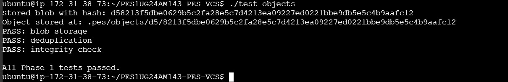

> All Phase 1 tests passed: blob storage, deduplication, and integrity check.

### Screenshot 1B — `find .pes/objects -type f` sharded directory structure

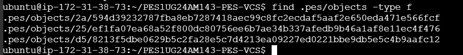

> Objects sharded by first 2 hex characters of their SHA-256 hash.

---

## Phase 2 — Tree Objects

**Concepts Covered:** Directory representation, recursive structures, file modes and permissions.

**Files Implemented:** `tree.c` — function `tree_from_index`

- `tree_from_index` builds a tree hierarchy from the staging index. It handles nested paths (e.g. `src/main.c` creates a `src` subtree), writes all tree objects to the object store, and returns the root tree hash. This is used by `pes commit` to snapshot the staged state.

### Screenshot 2A — `./test_tree` all tests passing

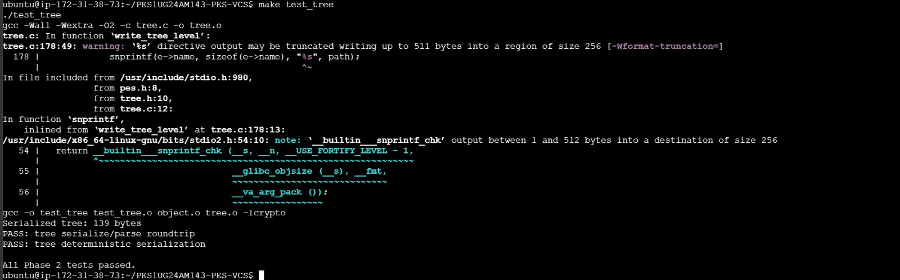

> All Phase 2 tests passed: serialize/parse roundtrip and deterministic serialization.

### Screenshot 2B — Raw binary format of a tree object via `xxd`

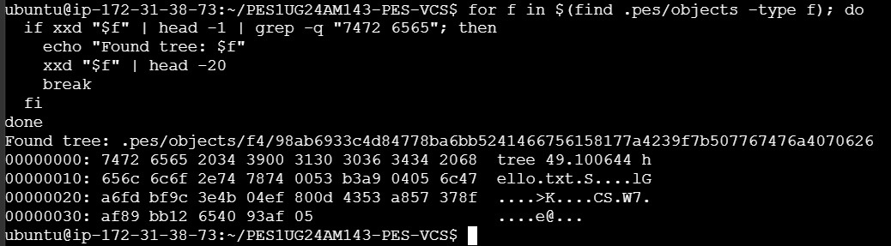

> Raw binary contents of a tree object showing mode, hash, and filename entries.

---

## Phase 3 — The Index (Staging Area)

**Concepts Covered:** File format design, atomic writes, change detection using metadata.

**Files Implemented:** `index.c` — functions `index_load`, `index_save`, `index_add`

- `index_load` reads the text-based `.pes/index` file, parsing each line as `<mode> <hash-hex> <mtime> <size> <path>`. If the file doesn't exist, it initializes an empty index without error.
- `index_save` sorts entries by path and writes atomically using `fsync()` on a temp file before renaming.
- `index_add` reads the file, writes its blob to the object store, and updates or creates the index entry using `index_find`.

### Screenshot 3A — `pes init` → `pes add` → `pes status`

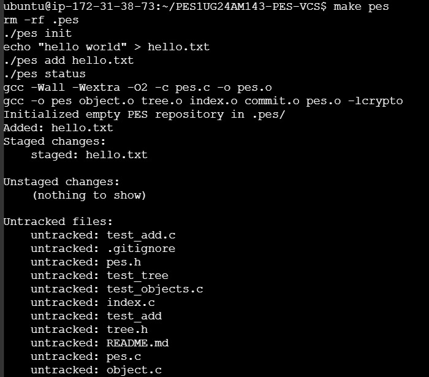

> Repository initialized, `hello.txt` staged correctly, status output showing staged/unstaged/untracked sections.

### Screenshot 3B — `cat .pes/index` showing text-format index

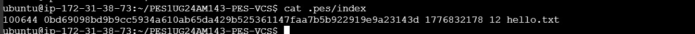

> Human-readable index file showing mode, hash, mtime, size, and filename for each staged entry.

---

## Phase 4 — Commits and History

**Concepts Covered:** Linked structures on disk, reference files, atomic pointer updates.

**Files Implemented:** `commit.c` — function `commit_create`

- `commit_create` builds a tree from the index using `tree_from_index()`, reads the current HEAD as the parent (absent for the first commit), gets the author from `pes_author()`, writes the commit object, and updates HEAD atomically.
- The commit creates a linked list of history via parent pointers, with HEAD always pointing to the latest commit through the branch ref.

### Screenshot 4A — `./pes log` showing three commits

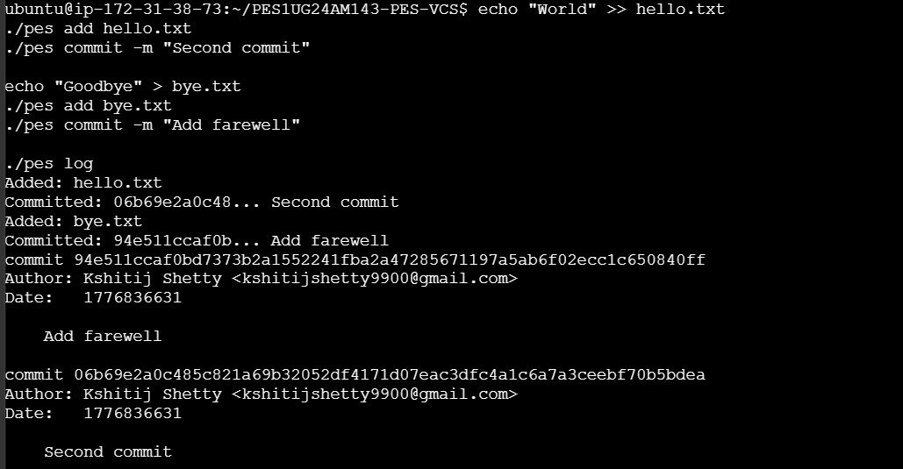

> Three commits with full hash, author, timestamp, and message displayed in reverse chronological order.

### Screenshot 4B — `find .pes -type f | sort` showing object growth

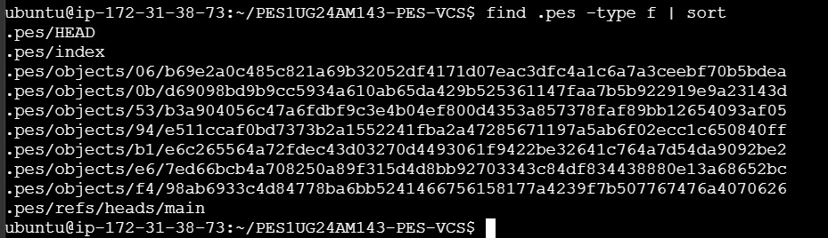

> Object store growth after three commits: blobs, trees, and commit objects all sharded correctly.

### Screenshot 4C — `cat .pes/refs/heads/main` and `cat .pes/HEAD`

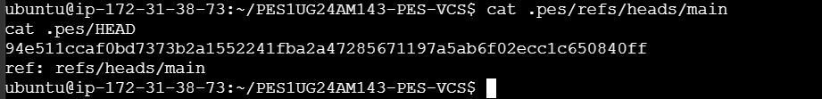

> Reference chain: HEAD → `ref: refs/heads/main` → latest commit hash.

---

## Phase 5 — Branching and Checkout (Analysis)

### Q5.1 — How would you implement `pes checkout <branch>`?

To implement `pes checkout <branch>`, the following must happen:

**Changes to `.pes/`:**
1. `.pes/HEAD` must be updated to contain `ref: refs/heads/<branch>`.
2. If the branch doesn't exist, a new file must be created at `.pes/refs/heads/<branch>` pointing to the current commit hash (creating a new branch).
3. If the branch exists, its commit hash is read from `.pes/refs/heads/<branch>`.

**Working directory update:**
Read the target commit object, extract its root tree hash, then recursively walk the tree. For each blob entry, read the blob from the object store and write it to the working directory at the correct path. Files present in the old tree but absent in the new one must be deleted.

**What makes this complex:**
- **Conflict detection:** If a tracked file is modified in the working directory and differs between branches, checkout must refuse to avoid silently discarding changes.
- **Recursive tree traversal:** Subdirectories require recursively creating nested directories and writing blobs.
- **File permissions:** The mode field in tree entries (`100644`, `100755`) must be correctly applied using `chmod`.
- **Atomicity:** A crash mid-checkout could leave the working directory in a mixed state. A safe implementation would stage all writes to temp files before doing the final swap.

---

### Q5.2 — How would you detect a "dirty working directory" conflict?

Using only the index and the object store:

1. For each file in the index, compute the SHA-256 blob hash of the current working directory version (identical to how `pes add` hashes files — prepend `blob <size>\0` then hash).
2. Compare this computed hash to the hash stored in the index entry. If they differ, the file is **modified but not staged** — it is dirty.
3. For each dirty file, check if the target branch's tree contains that file with a different hash than the current branch's tree.
4. If the file is dirty **and** it differs between the two branch trees, checkout must refuse — switching would silently overwrite uncommitted local changes.

This approach requires no extra metadata beyond the index (which holds the last-staged hash), the object store (to read both branch trees), and the filesystem (to re-hash working directory files).

---

### Q5.3 — What happens in detached HEAD state? How to recover?

**What happens:**
In detached HEAD state, `.pes/HEAD` contains a raw commit hash instead of `ref: refs/heads/<branch>`. New commits are created normally and chained via parent pointers, but no branch ref file is updated. When you switch away, HEAD is overwritten and the dangling commits become unreachable from any named reference — invisible to `pes log`, but still physically present in `.pes/objects/`.

**How to recover:**
Scan every file under `.pes/objects/`, reconstruct the hash from the directory and filename, parse each as a commit object, and identify commits whose hashes don't appear as a parent of any reachable commit. These are the dangling commits. Once found, create a new branch pointing to the most recent one:

```bash
echo "<dangling-commit-hash>" > .pes/refs/heads/recovery-branch
```

This is precisely what `git reflog` and `git fsck --lost-found` do in real Git. Git additionally maintains a reflog — a log of every position HEAD has pointed to — which makes recovery trivial even without scanning the full object store.

---

## Phase 6 — Garbage Collection (Analysis)

### Q6.1 — Algorithm to find and delete unreachable objects

**Mark phase (mark all reachable objects):**

1. Start from all branch refs in `.pes/refs/heads/` and HEAD.
2. For each ref, read the commit hash and add it to a **reachable hash set**.
3. Parse each commit: extract its tree hash and parent hash, add both to the set.
4. Recursively walk the tree: for each entry (blob or subtree), add its hash to the set. Recurse into subtrees.
5. Follow parent pointers backward through commit history until no new hashes are found.

**Sweep phase (delete unreachable objects):**

Walk every file under `.pes/objects/XX/YYY...`, reconstruct the hash from the path, and check against the reachable set. If not present, delete the file.

**Data structure:** A **hash set** (hash table keyed by 64-character hex hash string) is ideal — O(1) average insert and lookup, with memory proportional to the number of reachable objects only.

**Estimate for 100,000 commits, 50 branches:**
Assume each commit introduces ~3 new objects on average (1 commit + 1 tree + ~1 new blob). Total reachable objects ≈ 300,000. The mark phase visits all 300,000 reachable objects. The sweep phase visits all files in the object store — potentially more if unreachable objects have accumulated. With 50 branches, GC starts 50 traversals but quickly merges shared history, so the overhead is minimal relative to total commit count.

---

### Q6.2 — Race condition between GC and concurrent commit

**The race condition:**

1. `pes commit` runs and writes a **new blob** to `.pes/objects/`. The commit object and branch ref update have not happened yet.
2. GC starts its **mark phase** at this exact moment. It reads all branch refs and walks all reachable objects. The new blob has no commit pointing to it yet — GC does not mark it as reachable.
3. GC's **sweep phase** deletes the blob, since it appears unreachable.
4. The commit operation resumes, creates a commit + tree pointing to the now-deleted blob, and updates the branch ref.
5. The repository is now **corrupt** — the branch points to a commit whose blob no longer exists in the object store.

**How real Git avoids this:**

- **Grace period:** Git's GC never deletes objects newer than a configurable age (default: 2 weeks), regardless of reachability. Any object written during an in-progress operation is therefore safe.
- **Locking:** Git's GC acquires a lock file (`gc.pid`) before running, and in-progress operations write their own lock files, allowing GC to detect and defer.
- **Two-phase safety:** Real Git writes objects before updating refs. Since GC respects the grace period, a recently written but not-yet-referenced object is protected during the window between object write and ref update.

---

## Final Integration Test

### `make test-integration` — All tests passing

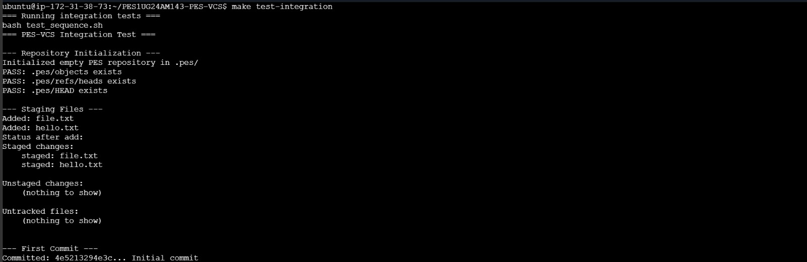
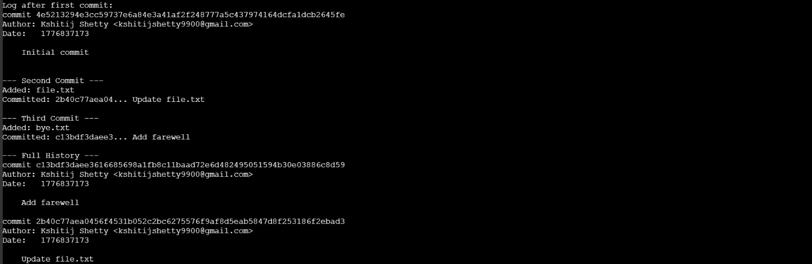
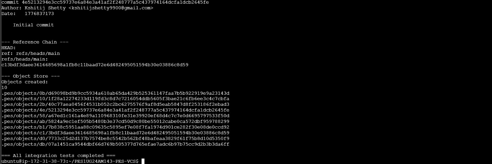

> Full end-to-end integration test confirming: repository initialization, staging, status, three commits, full history log, reference chain, and object store integrity — all passing.

---

## Summary

| Phase | Files Implemented | Status |
|-------|-------------------|--------|
| 1 — Object Storage | `object.c` (`object_write`, `object_read`) | ✅ Complete |
| 2 — Tree Objects | `tree.c` (`tree_from_index`) | ✅ Complete |
| 3 — Index / Staging | `index.c` (`index_load`, `index_save`, `index_add`) | ✅ Complete |
| 4 — Commits & History | `commit.c` (`commit_create`) | ✅ Complete |
| 5 — Branching Analysis | Q5.1, Q5.2, Q5.3 | ✅ Complete |
| 6 — GC Analysis | Q6.1, Q6.2 | ✅ Complete |
| Integration Test | `make test-integration` | ✅ All Passed |
